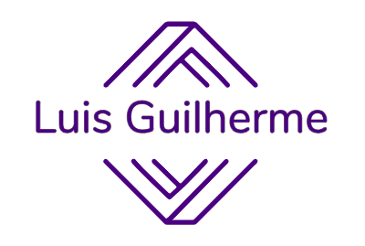

    

    <a href="#-dart-propósito-e-funcionamento">Propósito e Funcionamento</a> &#xa0; | &#xa0; 
    <a href="#-wrench-tecnologias-utilizadas-">Tecnologias Utilizadas</a> &#xa0; | &#xa0; 
    <a href="#-checkered_flag-instalação-">Instalação</a> &#xa0; | &#xa0;
    <a href="#----mag_right-screenshots">Screenshots</a> &#xa0; | &#xa0;
    <a href="#-clipboard-to-do">To-do</a> &#xa0; | &#xa0;
    <a href="#-link-links-">Links</a>

<h2 id="proposito" align="center"> :dart: Propósito e Funcionamento</h2>

    Este projeto foi desenvolvido durante o evento Front Week da Alura, como portfólio um website de portfólio.

<h2> :wrench: Tecnologias Utilizadas </h2>

<ul>
    <li>HTML 5</li>
    <li>SASS</li>
    <li>GSAP</li>
    <li>VSCode</li>
    <li>Javascript ES6</li>
</ul>

<h2> :checkered_flag: Instalação </h2>

Windows / Linux

    1. Download this repo, and open it with VSCode.
    2. Install Live Server and Live Sass Compiler
    3. When done, just click Go Live and Watch Sass.

<h2>
    :mag_right: Screenshots
</h2>

Screen Shots

    
    

<h2> :link: Links </h2>

